# My Shopping List

Developer - Alexandra Holstensson

[Link to the project](https://alexandrah-code.github.io/ms2-ShoppingList/)

Image (mobile, tablet, desktop)

## Table of Contents
- [About](#about)
- [User Goals](#user-goals)
  - [External User Goals](#external-user-goals)
  - [Site Owner Goals](#site-owner-goals)
- [User Stories](#user-stories)
- [Design Of The Website](#design-of-the-website)
  - [Structure](#structure)
  - [Wireframes](#wireframes)
  - [Colors](#colors)
  - [Fonts](#fonts)
  - [Icon And Image](#icon-and-image)
- [Existing Features](#existering-features)
  - [Add Item](#add-items)
  - [Edit Item](#edit-items)
  - [Delete Item](#delete-items)
  - [Save Shopping List To localStorage](#save-shopping-list-to-localstorage)
- [Features Left To Implement](#features-left-to-implement)
- [Technologies Used](#technologies-used)
  - [Languages](#languages)
  - [Programs And Other Resources](#programs-and-other-resources)
- [Testing](#testing)
  - [User Story Testing](#user-story-testing)
  - [Manual Testing](#manual-testing)
    - [Test - Add Items](#test---add-items)
    - [Test - Edit Items](#test---edit-items)
    - [Test - Delete Items](#test---delete-items)
    - [Test - Shopping List Saved To Local Storage](#test---shopping-list-saved-to-local-storage)
- [Bugs](#bugs)
- [Validation](#validation)
  - [HTML](#html)
  - [CSS](#css)
  - [JavaScript](#javascript)
- [Lighthouse Testing](#lighthouse-testing)
  - [Desktop](#desktop)
  - [Mobile](#mobile)
- [Device Testing](#device-testing)
- [Browser Compatibility](#browser-compatibility)
- [Deployment](#deployment)
- [Credits](#credits)
  - [Code](#code)
- [Acknowledgments](#acknowledgments)

### About 
[Back To The Top](#table-of-contents)

My Shopping List is a website where you can create a shopping list. 

My Shopping List has the following functions:
- add items
- edit items
- delete items

What is added to the shopping list is saved in localStorage. This means that what is added to the shopping list remains there even if you refresh the page or close it.

### User Goals
[Back To The Top](#table-of-contents)

#### External User Goals

- Be able to create a shopping list.
- Be able to edit and delete items in the shopping list.
- Be able to have the shopping list saved even if you refresh or close the page.

#### Site owner Goals

- Provide the ability for users/visitors to create a shopping list where items can be added, removed and edited.

### User Stories
[Back To The Top](#table-of-contents)

- As a visitor to the site, I want it to be usable on all types of screen sizes and devices (e.g. mobile, tablet, computer). This is so that I will not be dependent on a particular type of device.

- As a visitor to the site, I want it to be usable on all types of screen sizes and devices (e.g. mobile, tablet, computer). This is so that I will not be dependent on a particular type of device.

- As a visitor to the site, I want to be able to add items to the shopping list. This is so that I can see a summary of the items I intend to buy.

- As a visitor to the site, I want to be able to check off the items I have added to my shopping cart/picked up. This is so that I can easily see how many items are left (to buy).

- As a user of the site, I want to be able to edit and delete items that I have added to the shopping list. This is so that I cac delete things that I don't need or edit them if I realize that I need to make a change to something I have intended to buy.

- As a user of the site, I want the items I have added to the shopping list to remain even if I refresh the site or close it. This is so that I can easily continue on an existing shopping list if I come across more items that I want to add (or if I want to edit or delete one).

### Design Of The Website
[Back To The Top](#table-of-contents)

#### Structure

I have chosen not to have a main navigation menu on my site. This is because all functions fit on a single page. Therefore, there is no reason to have a navigation menu.

I have also chosen to have the main function for my page centered (horizontally) on the page because I think it looks the best.

#### Wireframes

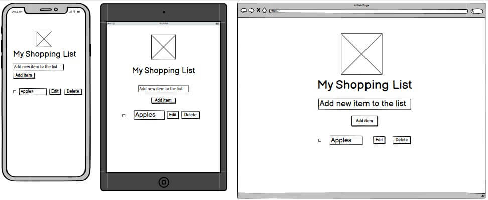

#### Colors

When I chose which colors to use on my page, I based my choice on the palette below, which is available at [Happy Hues](https://www.happyhues.co/).

[Link to the color palette that I have chosen](https://www.happyhues.co/palettes/12)

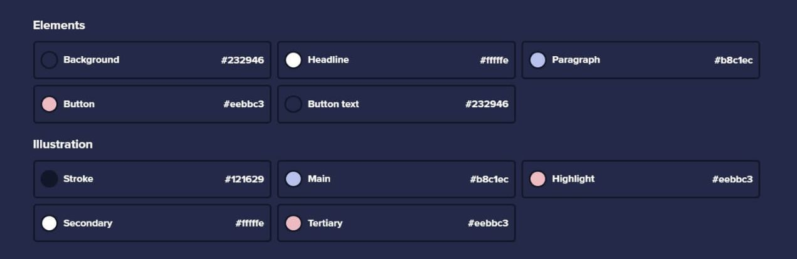

In order to create a gradient for the background color of the function itself, I used [ColorSpace](https://mycolor.space/). I have chosen to use #484266 as background color on my site.

[Link to my color gradient](https://mycolor.space/?hex=%23232946&sub=1) (See Matching Gradient)

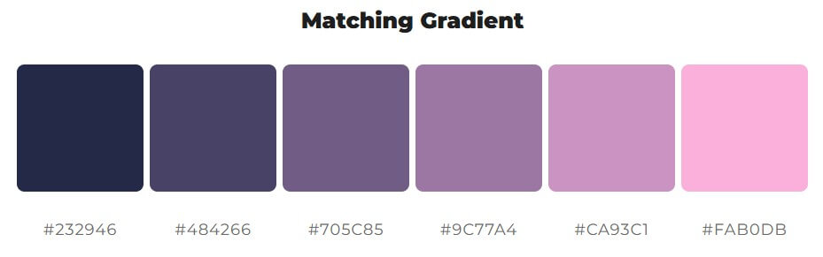

#### Fonts

To figure out which fonts to use on my site, I used [Easil's The Ultimate Free Font Pairing Guide](https://about.easil.com/free-font-pairing-guide-templates/). Here I chose the font Cookie because I wanted a font that looked a bit hand-written. In the pairing guide, the font Cookie is paired with the fonts Raleway and Roboto. Here I chose to use the font Roboto. I then downloaded the fonts from [Google Fonts](https://fonts.google.com/).

Links to the fonts:
- [Cookie](https://fonts.google.com/specimen/Cookie)
- [Roboto](https://fonts.google.com/specimen/Roboto)

#### Icon And Image

I have chosen to have a favicon on my site. The favicon was created from an image of a shopping basket that I found on [Open Clipart](https://openclipart.org/). To create the favicon itself, I then used [favicon.io](https://favicon.io/).

[Link to the image of the shopping basket](https://openclipart.org/detail/301004/basket-2)

The image of the shopping basket on the page is an icon that comes from [Font Awsome](https://fontawesome.com/).

[Link to the shopping basket](https://fontawesome.com/v6/icons/basket-shopping?f=classic&s=solid)

### Existering Features
[Back To The Top](#table-of-contents)
#### Add Item

To add an item to the shopping list, you enter the item in the text field and then click the Add item button. The item will then be added to the shopping list itself, which will be located below the form. In addition to the item name, a checkbox and an Edit and a Delete button also appear.

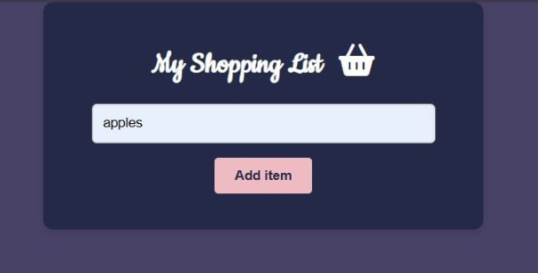

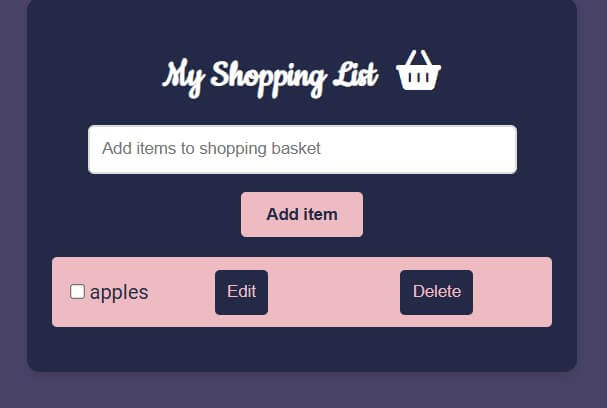

If you have purchased an item/added an item to your shopping cart, you can check the checkbox next to that item. The item name will then be crossed out.

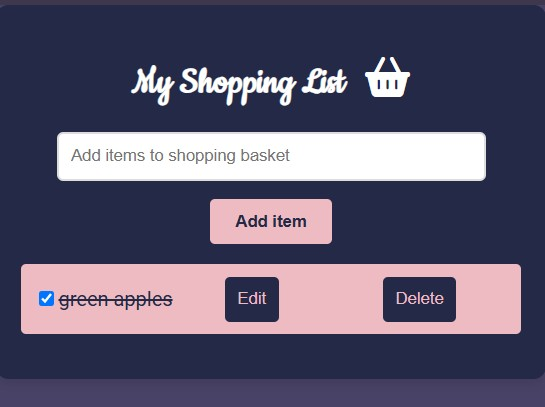

If you click the Add item button without having entered anything in the text box, a pop-up box will appear asking you to enter an item.

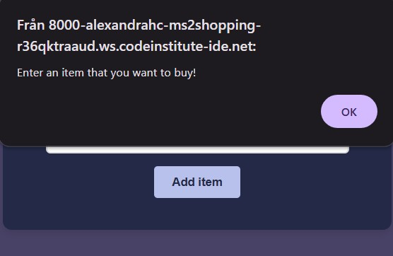

#### Edit Item

When you click the Edit button, a pop-up box appears. In it, you can make the change you want to make and then click Ok. The shopping list will then be updated with the change you have made.

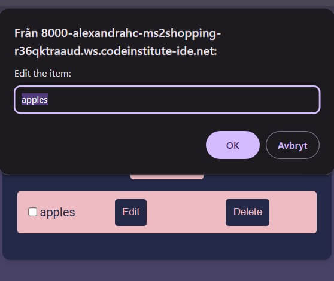

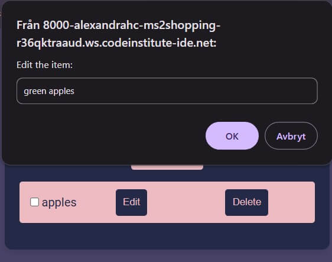

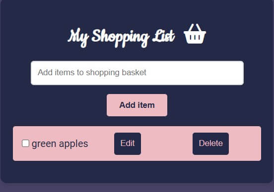

#### Delete Item

If you want to delete an item, click the Delete button next to that item. The item will then be removed from the shopping list.

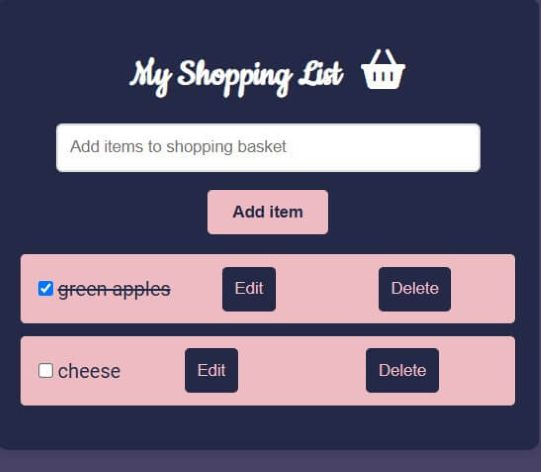
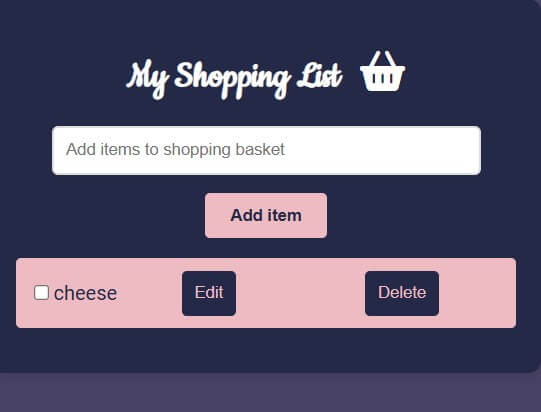

#### Save shopping list to localStorage

I have chosen to save the shopping list to localStorage. This is to be able to update or close the page without having to worry about the shopping list disappearing (see manual testing section to see how this feature works).

### Features Left To Implement
[Back To The Top](#table-of-contents)

To my shopping list, you could also add the ability to print the shopping list (if you prefer to have it in paper form). You could also add a function that makes it possible to sort the shopping list by a specific store (i.e. the shopping list is sorted by how a specific store is planned).

### Technologies Used
[Back To The Top](#table-of-contents)
#### Languages

- [HTML5](https://en.wikipedia.org/wiki/HTML)
- [CSS](https://en.wikipedia.org/wiki/CSS)
- [JavaScript](https://en.wikipedia.org/wiki/JavaScript)

#### Programs And Other Resources

- [Responsinator](http://www.responsinator.com/) - Used to check how the site looks on different devices and how responsive it is
- [Am I Responsive](https://ui.dev/amiresponsive) - Used to check how the site looks on different devices and how responsive it is
- [tinypng](https://tinypng.com/) - Used to compress images
- [HTML Validator](https://validator.w3.org/nu/) - Used to validate the HTML files
- [CSS Validator](https://jigsaw.w3.org/css-validator/) - Used to validate the CSS file
- [Open Clipart](https://openclipart.org/) - The image of the shopping basket can be found here
- [Favicon](https://favicon.io/favicon-converter/) - Used to generate the favicon
- [Fontawsome](https://fontawesome.com/) - For the shopping basket icon
- [Happy Hues](https://www.happyhues.co/) - for the color palette that I have chosen to use  
- [ColorSpace](https://mycolor.space/) - to find a color gradient to the background color on my shopping list function
- [Easils font pairing guide](https://about.easil.com/free-font-pairing-guide-templates/) - to find the fonts that I have chosen to use
- [Google Fonts](https://fonts.google.com/) - to download the fonts that I have chosen to use (Cookie and Roboto)

### Testing
[Back To The Top](#table-of-contents)
#### User Story Testing

| Feature | User Story | Expected Result | Pass |
|---------|------------|-----------------|------|

#### Manual Testing
##### Test - Add Items
##### Test - Edit Items
##### Test - Delete Items
##### Test - Shopping List Saved To Local Storage

### Bugs
[Back To The Top](#table-of-contents)

| Problem | Solution | Source of help |
|---------|----------|----------------|

### Validation
[Back To The Top](#table-of-contents)
#### HTML
#### CSS
#### JavaScript

### Lighthouse Testing
[Back To The Top](#table-of-contents)
#### Desktop
#### Mobile

### Device Testing
[Back To The Top](#table-of-contents)

In addition to my laptop (a Dell Vostro 3520), I have tested the site on my mobile phone, a Samsung Galaxy S24 Ultra, and on my tablet, a Samsung Galaxy Tab S8. The site works, and looks, as it should on all devices.

Then I have also tested my site on [Am I Responsive](https://ui.dev/amiresponsive) and [Responsinator](http://www.responsinator.com/) to see how it looks on other devices and if it is responsive.

### Browser Compatibility
[Back To The Top](#table-of-contents)

I have used the browsers below to test my site. The site looks as it should and works as it should in all browsers.

- Google Chrome (my primary browser)
- Microsoft Edge
- Opera
- Firefox

### Deployment
[Back To The Top](#table-of-contents)

This project was deployed to GitHub pages. To deploy the project, follow these steps:

1. In the GitHub repository, navigate to the Settings tab (last option in the top menu bar)
2. Then click on Pages in the vertical menu bar on the left.
3. Under Build and deployment
    - select Deploy from a branch under Source.
    - select and main (root) under Branch.
4. Then click on the Save button.
5. Back in the repository, you may have to wait a while before the deployment is complete.
6. The page can then be found under Deployments in the vertical menu bar on the right.
7. Click on github-pages and there is a link to the page.

Link to the project - https://alexandrah-code.github.io/ms2-ShoppingList/

### Credits
[Back To The Top](#table-of-contents)
#### Code

### Acknowledgments
[Back To The Top](#table-of-contents)

